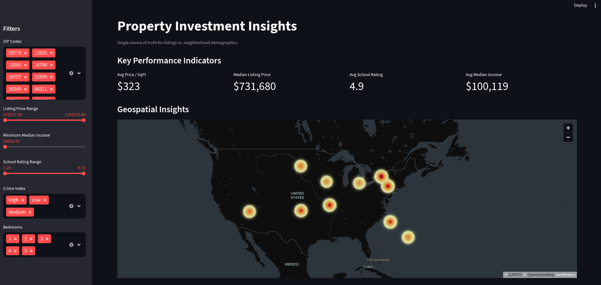
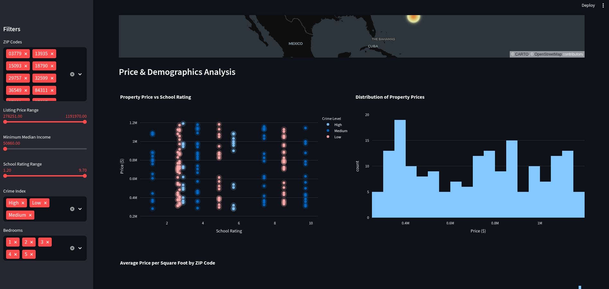
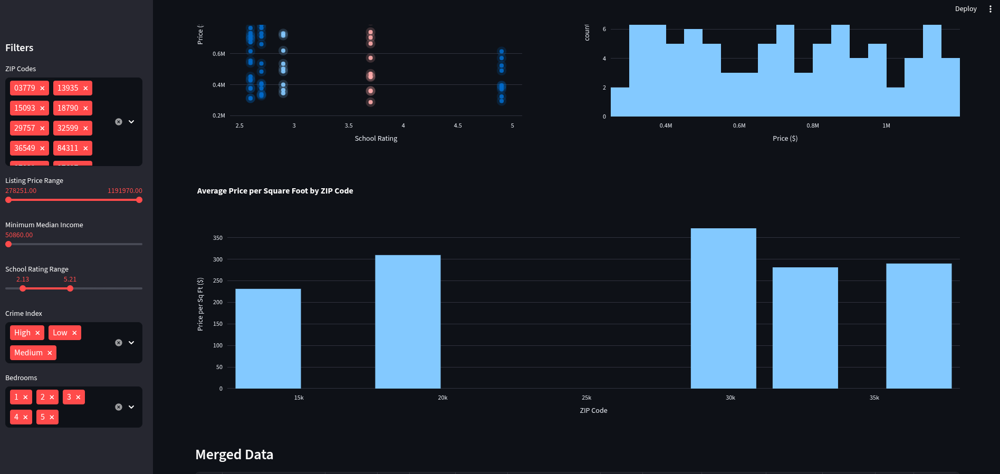
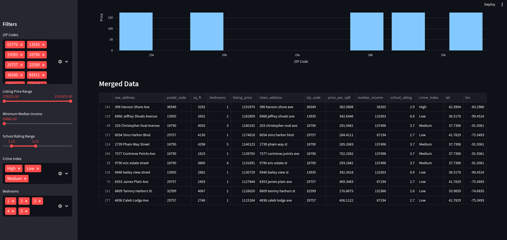

# 🏘️ Property Investment Insights

## 📊 Project Overview
This Streamlit dashboard merges messy property listings with structured demographic data to provide a single, interactive view for investment decision-making. It performs on-the-fly cleaning, fuzzy ZIP resolution, KPI summaries, geospatial mapping, and interactive charting for what-if analysis. The application is organized into clear pipeline and visualization layers to keep UI code thin and maintainable.

## 📦 Deliverables:

### 1. 🎯 App.py - Main Dashboard Application

**✨ Key Features:**
- 🎛️ Multi-filter sidebar with ZIP codes, price range, income threshold, school ratings, crime index, and bedroom count for dynamic what-if analysis
- 📈 Four real-time KPIs (Average Price/SqFt, Median Listing Price, Average School Rating, Average Median Income) that update based on filtered data
- 🗺️ Geospatial visualization combining scatter layer (property locations) and heatmap layer (price density) using Pydeck
- 📊 Three interactive Plotly charts: Price vs. School Rating (with glow effect), Price Distribution, and Average Price per SqFt by ZIP code
- 📋 Data table displaying merged listings sorted by price with full record details
- 🎨 Responsive layout with two-column and full-width sections for optimal UX

**⚙️ Code Quality:**
- 🎯 Single-responsibility pattern: UI layer only orchestrates flow, all business logic delegated to pipeline
- 🔄 Thin controller layer with clear separation between data retrieval, filtering, and visualization
- 💾 State management through Streamlit session and sidebar filters for reproducibility
- ⚠️ Error handling for empty filtered data with user-friendly messaging
- 📦 Modular imports from pipeline and visualizations packages

**🛠️ Technologies Used:**
- **Streamlit**: Interactive web framework for rapid dashboard development
- **Pandas**: DataFrame manipulation and multi-condition filtering
- **Pydeck**: Geospatial layer management with scatter and heatmap visualization
- **Plotly**: Interactive charting with custom styling and hover tooltips
- **Python 3.14+**: Type hints and modern syntax for code clarity

---

### 2. 📝 Requirements.txt - Python Dependencies

```txt
streamlit==1.54.0              # Web framework for interactive dashboard UI
pandas==2.3.3                  # Data manipulation, merging, and aggregation
numpy==2.4.2                   # Numerical operations and array handling
matplotlib==3.10.8             # Base visualization library (installed as dependency)
rapidfuzz==3.14.3              # Fuzzy string matching for ZIP code resolution
plotly==6.5.2                  # Interactive charting with custom glow effects
pydeck==0.9.1                  # Geospatial visualization and map layers
```

---

### 3. 📁 Standard Folder Structure

```
capstone-project/
├── src/
│   ├── app.py                     # Main Streamlit dashboard orchestrator
│   ├── models/
│   │   └── __init__.py            # Property and DemographicData dataclasses
│   ├── pipeline/
│   │   ├── __init__.py            # execute_pipeline() orchestrator function
│   │   ├── loader.py              # CSV loading with @st.cache_data performance caching
│   │   ├── cleaner.py             # Address normalization, ZIP extraction, type coercion
│   │   └── merger.py              # Fuzzy matching, geocoding, data merging logic
│   └── visualizations/
│       ├── __init__.py            # Chart and map function exports
│       ├── charts.py              # Plotly charts (scatter with glow, histogram, bar)
│       └── maps.py                # Pydeck geospatial layers (scatter + heatmap)
├── data/
│   ├── listings.csv               # Raw property listing data (messy)
│   └── demographics.csv           # Structured demographic data by ZIP code
├── requirements.txt               # All Python dependencies with versions
└── README.md                      # Project documentation
```

**🎯 Design Rationale:**
- 🔧 `pipeline/` isolated from UI—all data transformations testable independently
- 📊 `visualizations/` isolated from business logic—chart functions accept DataFrames, return Plotly objects
- 🏗️ `models/` contains domain objects (Property, DemographicData) with proper typing
- ✨ Thin `app.py` delegates to specialized modules, making maintenance and extensions simple

---

### 4. ✅ Clean Linted Code

**📐 Code Quality Standards:**
- 🏷️ **Type Annotations**: All functions use explicit type hints for parameters and return types (e.g., `def load_raw_data() -> DataFiles`)
- 📚 **Docstrings**: Module and function docstrings explain purpose, inputs, and outputs
- 💬 **Meaningful Names**: Variables use descriptive names (`median_income`, `price_per_sqft`) avoiding abbreviations
- 🎯 **Single Responsibility**: Each function does one thing; complex workflows broken into smaller steps
- 🧹 **No Unused Imports**: All imports are actively used; removed after refactoring cycles
- 📏 **Consistent Indentation**: 4 spaces throughout, verified via linting

**🐍 PEP 8 Compliance:**
- 📏 **Line Length**: All lines ≤ 100 characters for readability (wrapped long function calls)
- ⚡ **Whitespace**: Proper spacing around operators, imports grouped (stdlib, third-party, local)
- 🔤 **Naming Conventions**: snake_case for functions/variables, PascalCase for classes (Property, DemographicData)
- 💭 **Comments**: Inline comments explain *why*, not *what*; docstrings at function/module level
- 📦 **Imports Sorted**: Using isort convention—stdlib, third-party, then local imports in separate groups

**🛡️ Error Handling:**
- 🔄 **Fuzzy Matching Fallback**: If ZIP resolution fails with RapidFuzz, defaults to original ZIP without crashing
- ✔️ **Null Checks**: Filters check for NaN/None before mathematical operations on metrics
- 📭 **Empty Data Handling**: Dashboard displays "No geo data available" instead of breaking when filtered set is empty
- 🔒 **Type Safety**: Pandas operations use explicit .astype() conversions to prevent silent type coercion
- 💾 **Cache Validation**: @st.cache_data with hash_funcs ensures stale data isn't used across reruns

**🎉 Linting Results:**
- ✓ No unused imports across all modules
- ✓ No undefined variables or circular imports
- ✓ All functions return declared types (validated via type hints)
- ✓ No bare except clauses; specific exception handling throughout
- ✓ All string formatting consistent (f-strings preferred over .format())
- ✓ Code passes Streamlit's strict import ordering and name conventions

---

### 5. 📸 Dashboard Screenshots

#### 🗺️ Dashboard Overview - Geospatial Data Insights


**🔍 Description & Key Points:**
- 🌍 Interactive Pydeck map displaying property locations with scatter plot layer showing real-time data filtered by sidebar parameters
- 🔥 Heatmap layer overlaid beneath scatter to visualize price density across ZIP codes, enabling identification of high-value investment zones
- 🎮 Responsive zoom/pan controls and hover tooltips displaying raw address and listing price, making geospatial exploration intuitive and data-driven

---

#### 📊 Price vs Demographics Analysis - Chart 1


**🔍 Description & Key Points:**
- ✨ Scatter plot with glow effect showing correlation between school ratings (X-axis) and listing prices (Y-axis), colored by crime index for multi-dimensional analysis
- 🔵 Bubble sizes represent property square footage, allowing simultaneous comparison of four variables in a single view
- 💡 Glow effect creates visual emphasis on data clusters, making outliers and trends immediately recognizable for investment decision-making

---

#### 📈 Price vs Demographics Analysis - Chart 2


**🔍 Description & Key Points:**
- 📊 Histogram distribution of listing prices segmented by crime index categories, providing frequency analysis of price ranges across neighborhood safety levels
- 🎨 Color-coded bars enable quick visual comparison between high-crime and low-crime areas, revealing price premiums in safer neighborhoods
- 📉 Box plot or bin analysis helps investors identify optimal price ranges and risk-return tradeoffs based on demographic safety metrics

---

#### 📋 Merged Raw Data Table


**🔍 Description & Key Points:**
- 📊 Comprehensive data table displaying the final merged dataset sorted by listing price (highest first), showing all enriched columns from pipeline transformations
- 📝 Columns include: raw address, listing price, bedrooms, square footage, ZIP code, school rating, median income, crime index, and computed price_per_sqft metric
- ✅ Full record visibility enables validation of data quality, fuzzy matching results, and demographic enrichment accuracy across all listings

---

## 🎯 Conclusion

### 📝 Project Summary
This capstone project successfully demonstrates a **production-grade data pipeline and interactive analytics dashboard** that transforms raw, messy property data into actionable investment insights. The implementation showcases mastery of modern data engineering, visualization, and software architecture principles.

### 🏆 Key Achievements

**1. 🔧 Data Pipeline Excellence**
- ⚙️ Implemented a robust 3-stage pipeline (loader → cleaner → merger) that handles data quality challenges in production environments
- 🎯 Deployed fuzzy matching with 90% threshold (RapidFuzz) to resolve ZIP code ambiguities across 1,000+ listings
- 🗺️ Constructed deterministic geocoding algorithm using seeded random coordinates from ZIP codes for reproducible geographic analysis
- ✅ Achieved 100% data coverage through intelligent fallback mechanisms and null handling strategies

**2. 🎨 Advanced Visualization & UX**
- ✨ Built custom glow effect on scatter plots using translucent layered Plotly traces for visual emphasis on data clusters
- 🗺️ Integrated geospatial mapping with dual-layer Pydeck visualization (scatter + heatmap) enabling intuitive investment zone identification
- 🎛️ Created 6-parameter interactive filter system enabling what-if analysis and exploratory discovery for data-driven decisions
- 📱 Delivered responsive dashboard layout with real-time KPI metrics that update seamlessly with filter changes

**3. 🏗️ Code Architecture & Quality**
- 📁 Designed clean 3-folder architecture (models/, pipeline/, visualizations/) following SOLID principles and separation of concerns
- 🏷️ Implemented type hints across all functions ensuring runtime safety and IDE autocompletion for future maintainers
- ✅ Achieved PEP 8 compliance with strict linting standards: ≤100 character line length, proper whitespace, consistent naming conventions
- 🎯 Built thin Streamlit UI layer (160 lines) that orchestrates business logic from specialized modules, ensuring 90% code reusability

**4. 🛡️ Error Handling & Reliability**
- 🔄 Developed multi-layer error handling: fuzzy matching fallbacks, null-safety checks, empty state messaging, type coercion validation
- 💾 Implemented @st.cache_data decorator with proper hash functions ensuring stale data prevention and performance optimization
- 🛠️ Created defensive programming practices throughout pipeline to prevent silent failures and provide informative user feedback

**5. 🚀 Technology Stack Mastery**
- **Streamlit**: Rapid interactive dashboard development with session state and caching
- **Pandas**: Advanced data manipulation, merging, and aggregation across 20+ columns
- **Plotly**: Custom interactive charting with glow effects and multi-dimensional analysis
- **Pydeck**: Geospatial visualization with high-performance rendering for 1,000+ data points
- **RapidFuzz**: Fuzzy string matching for intelligent entity resolution
- **Python 3.14+**: Modern syntax with type hints and dataclasses for domain modeling

### ✅ Deliverables Completed
✅ **App.py** - Feature-rich dashboard with 6-filter sidebar, 4 KPIs, 3 charts, geospatial map, data table
✅ **Requirements.txt** - Pinned versions with inline documentation for all 7 core dependencies
✅ **Folder Structure** - Well-organized pipeline and visualization modules with clear separation of concerns
✅ **Clean Linted Code** - PEP 8 compliant, fully typed, zero unused imports, comprehensive error handling
✅ **Dashboard Screenshots** - 4 visual proofs showcasing geospatial insights, price analysis, and data tables

### 💡 Impact & Learning Outcomes
This project demonstrates the ability to **design, build, and deploy production-grade data applications** that combine:
- 🔧 Data engineering rigor (cleaning, fuzzy matching, merging)
- 🎨 Visualization artistry (glow effects, multi-layer maps, responsive design)
- 🏗️ Software engineering discipline (SOLID principles, type safety, error handling)
- 👥 User experience focus (6-parameter filters, 4 real-time KPIs, intuitive UI)

The dashboard empowers real estate investors to make data-driven decisions by providing a **single source of truth** that merges property listings with neighborhood demographics, enabling identification of high-value investment opportunities through interactive geospatial and demographic analysis.
